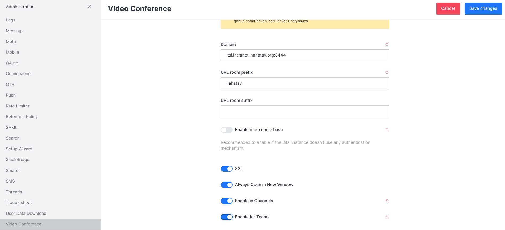

# A Docker-Based Intranet 

## Before starting

To run the implementation, make sure you have installed **Docker Engine** and **Docker-compose**

If not, check the following instructions:

* For **Docker** follow this [installation guide](https://docs.docker.com/install/linux/docker-ce/ubuntu/).

* For **Docker-compose**, just run these commands:

  ```bash
  sudo curl -L "https://github.com/docker/compose/releases/download/1.22.0/docker-compose-$(uname -s)-$(uname -m)"  -o /usr/local/bin/docker-compose
  sudo mv /usr/local/bin/docker-compose /usr/bin/docker-compose
  sudo chmod +x /usr/bin/docker-compose
  ```

**Make sure** you don't need to type `sudo` every time you run docker. To do so, run the following command and then log out and in again:

```source
sudo usermod -aG docker $(whoami)
```

## Setting Everything Up

This section explains how to set up all the services. In this use case we are using 2 servers to host the following services:

* Office Server (Intel i5 @ 3.10GHz, 4 cores, 12 GB RAM)
  * Nextcloud instance. Shared files cloud storage (mostly for documentation).
  * Rocket chat. Chat room for teams and file sharing.
  * Pihole. DNS server for the internet and local domains. Also acts as ads blocker and metric recopilatoin.
  * Portainer. Docker management tool.
  * Traefik. Reverse proxy and load balancer.
  * Squid. Proxy server for the internet. The goal is to use HTTP cache to reduce the number of queries to the internet. (Not fully tested).
  * Librespeed. Speed test tool to measure the available throughout inside the intranet.

* Media Server (Intel i3 @ 2.93GHz, 4 cores, 8 GB RAM)
  * Nextcloud instance. This is the server that will host the media files.
  * Jitsi meet. This is the server that will host the video/voice calls. We are using jitsi meet integrated with rocketchat.
  * Portainer. Docker management tool

### Setting Office Server Up

First, create  network through which all containers will communiacate between them. These is mandatory due to the fact that we want Traefik to act as a reverse proxy for this network.

```source
docker network create proxy
```

#### Set up Pihole

SSH to office server and clone the repo:

```source
git clone https://github.com/aucoop/self-hosted-docker-server
cd self-hosted-docker-server/office-server
```

After that, cd into the `pihole` directory in order to set pihole up:

```source
cd pihole
docker-compose up -d
```

That will bring up pihole, an adblocker and DNS server.

> If using Ubuntu Server, probably you get a nslookup error or something like that. Make sure your `/etc/resolv.conf` file points to a well known DNS server like `1.1.1.1` or `8.8.8.8`. See the pihole section inside the caveats section for more details about that.

Now, go to pihole container to add the local DNS domains into the DNS server. Go to the pihole container dashboard (`http://192.168.10.2:8000/admin/`), go to `Login` and login with the password specified previously. Then go to Local DNS -> DNS Records and add the following domains:

| Domain                          | IP           |
| ------------------------------- | ------------ |
| chat.domain.com                 | 192.168.10.2 |
| cloud.domain.com                | 192.168.10.2 |
| librespeed.domain.com           | 192.168.10.2 |
| portainer.domain.com            | 192.168.10.2 |
| server.domain.com               | 192.168.10.2 |
| traefik.domain.com              | 192.168.10.2 |
| jitsi.domain.com                | 192.168.10.2 |
| media.domain.com                | 192.168.10.3 |

Now make sure that the router of the local network is configured to forward the DNS queries to the pihole container. Important, make sure the router has Pihole as the **only DNS server**, otherwise resolving local DNS won't work as expected. Didn't find a workaround for that, could be nice to have a well known DNS server as  secondary DNS in case the pihole instance is not working, access to the internet is still permitted, but for some reason this configuration is not possible. More info on this regard on offical documentation: [How do I configure my devices to use Pi-hole as their DNS server?](https://discourse.pi-hole.net/t/how-do-i-configure-my-devices-to-use-pi-hole-as-their-dns-server/245).

> Note: Domain for pihole is not there for simplicity sake. The Traefik reverse proxy redirects everything to the https port, and the pihole dashboard is only accessible through http (AFAIK). For simplicity, I left it accessible only through http via IP and the port 8000, i.e. `192.168.10.2:8000`

#### Set up Traefik

Trafik is a reverse proxy and load balancer. It is used to redirect all the traffic to the specific service only using the well known ports. It also allows to use signed certificates for the running services via Let's encrypt, that means nothing will complain about not trusting the site. In order to set up  and understand this, was very helpful to see this video: [Put Wildcard Certificates and SSL on EVERYTHING - Traefik Tutorial](https://www.youtube.com/watch?v=liV3c9m_OX8)

The steps to have traefik working are the following:

* Create the `data/` directory

  ```source
  cd ../traefik
  mkdir data
  cd data
  ```

* Create the `acme.json` file where the certificates will be stored.

  ```source
  touch acme.json
  chmod 600 acme.json
  ```

* Create the `config.yml` file where the configuration will be stored.

  ```source
  touch config.yml
  ```

* Create the `traefik.yml` and compy the following content:

  ```yaml
  api:
    dashboard: true
    debug: true
  <!-- log:
    level: DEBUG -->
  entryPoints:
    http:
      address: ":80"
    https:
      address: ":443"
  serversTransport:
    insecureSkipVerify: true
  providers:
    docker:
      endpoint: "unix:///var/run/docker.sock"
      exposedByDefault: false
    file:
      filename: /config.yml
  certificatesResolvers:
    cloudflare:
      acme:
        email: YOUR_MAIL
        storage: acme.json
        dnsChallenge:
          provider: cloudflare
          resolvers:
            - "1.1.1.1:53"
            - "1.0.0.1:53"
  ```

  * Make sure you add the `YOUR_MAIL` address (the cloudfare) address.
  * As it can be seen, this configuration file assumes that your domain is managed by cloudfare. If you want to use another provider, you can change the provider name to the one you want (and make sure what `resolvers` use).

* Make sure also you fill in the following environment variables:

  ```yaml
      environment:
      # CF_API_EMAIL, CF_API_KEY - The Global API Key needs to be used, not the Origin CA Key
      - CF_API_EMAIL=${CLOUDFARE_EMAIL}
      - CF_API_KEY=${CLOUDFARE_API_KEY}
  ```

You can check if everything went fine by checking the logs (`docker logs traefik --follow`) or by checking the dashboard traefik.domain.com and see the connection secure green lock.

#### Set up Portainer

```source
cd ../portainer
docker-compose up -d
```

You can make sure everything is running properly by checking the container status in portainer (`192.168.10.2:9000` or `protainer.domain.com`).

#### Set up Nextcloud

FIrst, create a `.env` file with the required environment variables.

```source
cd ../nextcloud
touch .env
```

The `.env` file needs to have the following content:

```source
MYSQL_ROOT_PSSWD=mysqlpassword
DB_NAME=nextcloud
DB_USER=nuser
DB_PASSWORD=password
```

Then, you can start the container with the following command:

```source
docker-compose up
```


Make sure you select MySQL as the database engine, which is better suited for a production environment. More info on how to configure that on [this tutorial](https://docs.linuxserver.io/general/swag#nextcloud-subdomain-reverse-proxy-example).

Also make sure you don't install the "Recommended Apps", [linuxserver.io](https://linuxserver.io), the provider of the image [recommends not to do so](https://docs.linuxserver.io/images/docker-nextcloud).

#### Set up Rocketchat

In order to get rocketchat running:

```source
cd ../rocketchat
docker-compose up -d
```

> Note: the mongo version being used is deprecated and rocketchat complains about it. Planning on fix that later.

> Note 2: There is a warning about a `REG_TOKEN` empty that will be fixed also at some point.

Follow the setup wizard to get the chat running, pretty straightforward.

Once the Rocket chat instance is set up and running, we are going to see how to enable video and audio calls in rocketchat by integrating jitsi meet.

### Set up Jitsi

Jitsi is a service to enable videoconferencing. However, the main use case in this server set up is to enable video/voice calls in rocketchat.

In order to get jitsi running, the [quickstart guide from jitsi official docs](https://jitsi.github.io/handbook/docs/devops-guide/devops-guide-docker/) has been used. Maybe a better approach can be used, but this seems to work for now. In this set up, I'm using version 7001 (latest one ATM).

* The TL;DR here:

  ```source
  cd ..
  wget https://github.com/jitsi/docker-jitsi-meet/archive/refs/tags/stable-7001.zip
  unzip stable-7001.zip
  rm stable-7001.zip
  mv docker-jitsi-meet-stable-7001/ jitsi
  cd jitsi
  cp env.example .env
  ./gen-passwords.sh
  mkdir -p ~/.jitsi-meet-cfg/{web/crontabs,web/letsencrypt,transcripts,prosody/config,prosody/prosody-plugins-custom,jicofo,jvb,jigasi,jibri}
  ```

Before running the `docker-compose up -d` command, we needed to configure the following parameters in the `.env` file. Open the `.env` with a text editor and follow the next steps:

* Add the line: `ENABLE_XMPP_WEBSOCKET=0`. This will allow to add a port in the domain.

* Change the `HTTPS` and `HTTP` port if needed. In my setup:

  ```bash
  # Exposed HTTP port
  HTTP_PORT=8081

  # Exposed HTTPS port
  HTTPS_PORT=8444
  ```

* Set timezone

  ```source
  TZ=Africa/Dakar
  ```

* Add `PUBLIC_URL`:
  
    ```bash
    # Public URL for the web service (required)
    PUBLIC_URL=https://jitsi.domain.com
    ```

* **Very important:** Add `DOCKER_HOST_ADDRESS` if running in a LAN environment, otherwise jitsi won't fit more than 2 people in the call.

    ```bash
    DOCKER_HOST_ADDRESS=192.168.10.2
    ```

Save changes in `.env` file and run `docker-compose up -d`.

Now, go to chat.domain.com, login to rocketchat with the admin account and enable the jitsi integration, to do so, go to Administration -> VideoConference -> Jitsi. More in depth about the procedure in [this tutorial](https://www.inmotionhosting.com/support/edu/software/jitsi-rocketchat/). The parameters that work in my set up are the following ones:



There is one step more involved left. In order to properly use video/voice calls with the mobile app, jitsi has to run in https with a valid certificate. Jitsi is not supported to be running behind traefik AFAIK (or it's quite complex and I haven't figured it out).

What we do here is to copy the certificate generated from let's encrypt from the `acme.json` file and copy it into jitsi.

* First, create the directory to store the certificates:

```source
cd ~/self-hosted-docker-server/office-server/jitsi/
mkdir certificates
```

* Extact the certificate from the `acme.json`:

  ```source
  less ~/self-hosted-docker-server/office-server/traefik/data/acme.json | grep certificate | cut -c 25- | rev | cut -c 3- | rev | base64 --decode >  ~/self-hosted-docker-server/office-server/jitsi/certificates/cert.crt
  ```

* Extract the key from the `acme.json`:

  ```source
  less ~/self-hosted-docker-server/office-server/traefik/data/acme.json | grep key | cut -c 17- | rev | cut -c 3- | rev | base64 --decode > ~/self-hosted-docker-server/office-server/jitsi/certificates/cert.key
  ```

* Now add the following line to the `docker-compose.yml` in the `jitsi` directory.

  ```yaml
  volumes:
    - ./certificates:/config/keys:Z 
  ```

* Now delete the old `.jitsi-meet-cfg/` directory:

```source
sudo rm -rf ~/.jitsi-meet-cfg/
```

* Run docker-compose up again:

```source
docker-compose down
docker-compose up -d
```

### Setting Media Server Up

SSH to media server and clone the repo:

```source
git clone https://github.com/aucoop/self-hosted-docker-server
cd self-hosted-docker-server/media-server
```

For now, the only service running in this server is nextcloud, so go to `nextcloud` directory and follow the same procedure than before.

## Caveats for some services

### HTTPS Access

Some services (nextcloud, rocketchat and jitsi) require HTTPS access. So make sure that you type `https://` in the browser URL when accessing this server. If you don't do that Traefik won't redirect the traffic to the HTTPS port for you, and probably will return you a 404 error.

On the other hand, traefik provides a self signed certificate, so you can access the services without any problems, but you will get a warning from your browser asking to trust the certificate because is self signed. If you have your local network accessible from the outside, you can easily get a signed certificate by a certified CA (Let's encrypt).

### Nextcloud

First of all, is needed to add the local IP range or domain as a trusted domain. Since we use nextcloud in our local network and it's not exposed to the outside, it's fine to add local IP range as a trusted domain. To do so:

Edit `config.php` inside the nextcloud volume (`nextcloud/nextcloud/config/config.php`) in the host machine. Admin permission is needed to edit the file. Add the following line:

In

```source
'trusted_domains' =>
  array (
    0 => 'localhost:8000',
  ),
```

We will add the local IP range as a trusted domain:

```source
'trusted_domains' =>
  array (
    0 => 'localhost:8000',
    1 => '192.168.*.*',
  ),
```

We also can add domains:

```source
'trusted_domains' =>
  array (
    0 => 'localhost:8000',
    1 => '192.168.*.*',
    2 => 'server.hahatay',
  ),
```

That configuration should work for most local network since most routers assign this range to the local network.

Now we're ready to connect there from any client in the same network as the server.

### Pihole

When setting up the DNS server, most likely the host will complain because there is already a DNS server running. In Ubuntu server `bind` is listening to port `53` by default, and pihole will complain about that. To fix this, I found out this answer from [pihole forum](https://discourse.pi-hole.net/t/docker-unable-to-bind-to-port-53/45082/7):

```source
Port 53 is being used at your host machine, that's why you can not bind 53 to host.

To find what is using port 53 you can do: sudo lsof -i -P -n | grep LISTEN

I'm a 99.9% sure that systemd-resolved is what is listening to port 53. To solve that you need to disable it. You can do that with these 2 commands:

    systemctl disable systemd-resolved.service
    systemctl stop systemd-resolved

Now you have port 53 open, but no dns configured for your host. To fix that, you need to edit '/etc/resolv.conf' and add the dns address. This is an example with a common dns address:

nameserver 8.8.8.8

If you have another nameserver in that file, I would comment it to prevent issues.
Once pihole docker container gets running, you can change the dns server of your host to localhost, as you are binding port 53 to the host machine. Change again '/etc/resolv.conf' like this

nameserver 127.0.0.1
```
