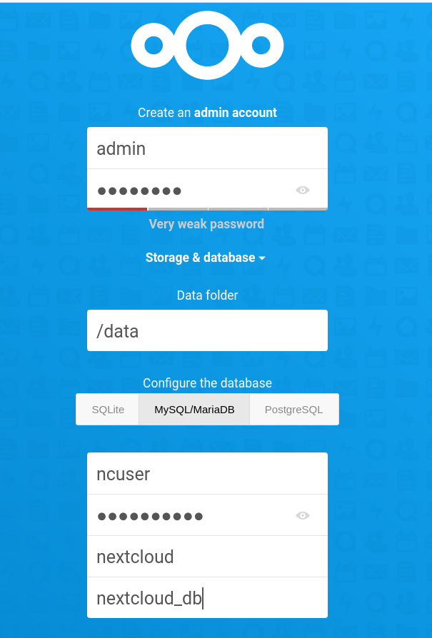

# A Docker-Based Intranet 

## Before starting

To run the implementation, make sure you have installed **Docker Engine** and **Docker-compose**

If not, check the following instructions:

* For **Docker** follow this [installation guide](https://docs.docker.com/install/linux/docker-ce/ubuntu/).

* For **Docker-compose**, just run these commands:

  ```bash
  sudo curl -L "https://github.com/docker/compose/releases/download/1.22.0/docker-compose-$(uname -s)-$(uname -m)"  -o /usr/local/bin/docker-compose
  sudo mv /usr/local/bin/docker-compose /usr/bin/docker-compose
  sudo chmod +x /usr/bin/docker-compose
  ```

**Make sure** you don't need to type `sudo` every time you run docker. To do so, run the following command and then log out and in again:

```source
sudo usermod -aG docker $(whoami)
```

## Setting Everything Up

This section explains how to set up all the services. In this use case we are using 2 servers to host the following services:

* Office Server (Intel i5 @ 3.10GHz, 4 cores, 12 GB RAM)
  * Nextcloud instance. Shared files cloud storage (mostly for documentation).
  * Rocket chat. Chat room for teams and file sharing.
  * Pihole. DNS server for the internet and local domains. Also acts as ads blocker and metric recopilatoin.
  * Portainer. Docker management tool.
  * Traefik. Reverse proxy and load balancer.
  * Squid. Proxy server for the internet. The goal is to use HTTP cache to reduce the number of queries to the internet. (Not fully tested).
  * Librespeed. Speed test tool to measure the available throughout inside the intranet.

* Media Server (Intel i3 @ 2.93GHz, 4 cores, 8 GB RAM)
  * Nextcloud instance. This is the server that will host the media files.
  * Jitsi meet. This is the server that will host the video/voice calls. We are using jitsi meet integrated with rocketchat.
  * Portainer. Docker management tool

### Setting Office Server Up

SSH to office server and clone the repo:

```source
git clone https://github.com/aucoop/self-hosted-docker-server
cd self-hosted-docker-server/office-server
docker-compose up -d
```

> If using Ubuntu Server, probably you get a nslookup error or something like that. Make sure your `/etc/resolv.conf` file points to a well known DNS server like `1.1.1.1` or `8.8.8.8`. See the pihole section inside the caveats section for more details about that.

Now, go to pihole container to add the local DNS domains into the DNS server. Go to the pihole container dashboard (`http://192.168.10.2:8000/admin/`), go to `Login` and login with the password specified previously. Then go to Local DNS -> DNS Records and add the following domains:

| Domain             | IP           |
| ------------------ | ------------ |
| chat.hahatay       | 192.168.10.2 |
| cloud.hahatay      | 192.168.10.2 |
| librespeed.hahatay | 192.168.10.2 |
| media.hahatay      | 192.168.10.3 |
| pihole.hahatay     | 192.168.10.2 |
| portainer.hahatay  | 192.168.10.2 |
| server.hahatay     | 192.168.10.2 |
| traefik.hahatay    | 192.168.10.2 |
| whoami.hahatay     | 192.168.10.2 |
| jitsi.hahatay      | 192.168.10.3 |

Now make sure that the router of the local network is configured to forward the DNS queries to the pihole container. Important, make sure the router has Pihole as the **only DNS server**, otherwise resolving local DNS won't work as expected. Didn't find a workaround for that, could be nice to have a well known DNS server as  secondary DNS in case the pihole instance is not working, access to the internet is still permitted, but for some reason this configuration is not possible. More info on this regard on offical documentation: [How do I configure my devices to use Pi-hole as their DNS server?](https://discourse.pi-hole.net/t/how-do-i-configure-my-devices-to-use-pi-hole-as-their-dns-server/245).

You can make sure everything is running properly by checking the container status in portainer (192.168.10.2:9000).

#### Set up Nextcloud



Make sure you select MySQL as the database engine, which is better suited for a production environment. More infop on how to configure that on [this tutorial](https://docs.linuxserver.io/general/swag#nextcloud-subdomain-reverse-proxy-example).

Also make sure you don't install the "Recommended Apps", linuxserver.io, the provider of the image [recommends not to do so](https://docs.linuxserver.io/images/docker-nextcloud).

#### Rocketchat

Follow the setup wizard to get the chat running, pretty straightforward.

### Setting Media Server Up

SSH to media server and clone the repo:

```source
git clone https://github.com/aucoop/self-hosted-docker-server
cd self-hosted-docker-server/media-server
docker-compose up -d
```

### Set up Jitsi

Jitsi is a service to enable videoconferencing. However, the main use case in this server set up is to enable video/voice calls in rocketchat.

In order to get jitsi running, the [quickstart guide from jitsi official docs](https://jitsi.github.io/handbook/docs/devops-guide/devops-guide-docker/) has been used. Probably a better approach can be used.

Once followed the quickstart guide, the jitsi server is running, but still is needed to configure the following parameters in the `.env` file:

* Add `ENABLE_XMPP_WEBSOCKET=0` in `.env` file. This will allow to add a port in the domain.
* Change the `HTTPS` and `HTTP` port if needed:

  ```bash
  # Exposed HTTP port
  HTTP_PORT=8081

  # Exposed HTTPS port
  HTTPS_PORT=8444
  ```

* Set timezone
  `TZ=Africa/Dakar`

* Add `PUBLIC_URL`:
  
    ```bash
    # Public URL for the web service (required)
    PUBLIC_URL=https://192.168.10.3
    ```

* Add `DOCKER_HOST_ADDRESS` if running in a LAN environment, otherwise jitsi won't fit more than 2 people in the call.

    ```bash
    DOCKER_HOST_ADDRESS=192.168.10.3
    ```

## Caveats for some services

### HTTPS Access

Some services (nextcloud, rocketchat and jitsi) require HTTPS access. So make sure that you type `https://` in the browser URL when accessing this server. If you don't do that Traefik won't redirect the traffic to the HTTPS port for you, and probably will return you a 404 error.

On the other hand, traefik provides a self signed certificate, so you can access the services without any problems, but you will get a warning from your browser asking to trust the certificate because is self signed. If you have your local network accessible from the outside, you can easily get a signed certificate by a certified CA (Let's encrypt).

### Nextcloud

First of all, is needed to add the local IP range or domain as a trusted domain. Since we use nextcloud in our local network and it's not exposed to the outside, it's fine to add local IP range as a trusted domain. To do so:

Edit `config.php` inside the nextcloud volume (`nextcloud/nextcloud/config/config.php`) in the host machine. Admin permission is needed to edit the file. Add the following line:

In

```source
'trusted_domains' =>
  array (
    0 => 'localhost:8000',
  ),
```

We will add the local IP range as a trusted domain:

```source
'trusted_domains' =>
  array (
    0 => 'localhost:8000',
    1 => '192.168.*.*',
  ),
```

We also can add domains:

```source
'trusted_domains' =>
  array (
    0 => 'localhost:8000',
    1 => '192.168.*.*',
    2 => 'server.hahatay',
  ),
```

That configuration should work for most local network since most routers assign this range to the local network.

Now we're ready to connect there from any client in the same network as the server.

### Pihole

When setting up the DNS server, most likely the host will complain because there is already a DNS server running. In Ubuntu server `bind` is listening to port `53` by default, and pihole will complain about that. To fix this, I found out this answer from [pihole forum](https://discourse.pi-hole.net/t/docker-unable-to-bind-to-port-53/45082/7):

```source
Port 53 is being used at your host machine, that's why you can not bind 53 to host.

To find what is using port 53 you can do: sudo lsof -i -P -n | grep LISTEN

I'm a 99.9% sure that systemd-resolved is what is listening to port 53. To solve that you need to disable it. You can do that with these 2 commands:

    systemctl disable systemd-resolved.service
    systemctl stop systemd-resolved

Now you have port 53 open, but no dns configured for your host. To fix that, you need to edit '/etc/resolv.conf' and add the dns address. This is an example with a common dns address:

nameserver 8.8.8.8

If you have another nameserver in that file, I would comment it to prevent issues.
Once pihole docker container gets running, you can change the dns server of your host to localhost, as you are binding port 53 to the host machine. Change again '/etc/resolv.conf' like this

nameserver 127.0.0.1
```
